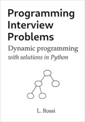

This is a book presenting a selection of dynamic programming problems that are often asked in programming interviews.

Detailed solutions and explanations are given for all problems.
The solutions consist of cleanly written code, with modular structure, clear variable names and plenty of comments.
These are accompanied by verbal explanations, hundreds of drawings,
diagrams and detailed examples, to help you get a good understanding of even the toughest problems.

The goal of the book is for you to learn the patterns and principles needed to solve even dynamic programming problems that you have never seen before.

The book is available for [purchase on Amazon](https://www.amazon.com/dp/B08MSQ3S7V):

)

### Here is what you will get:

* A 180-page book presenting dynamic programming problems that are often asked in interviews.
* Multiple solutions for each problem, starting from simple but naive answers that are gradually improved until reaching the optimal solution.
* Plenty of detailed examples and walkthroughs, so that you can see right away how the solution works.
* 350+ drawings and diagrams which cater towards visual learners.
* Clear and detailed verbal explanations of how to approach the problems and how the code works.
* Analysis of time and space complexity.
* Discussion of other variants of the same problem, with solutions.
* Unit tests, including the reasoning behind choosing each one (edge case identification, performance evaluation etc.).
* Suggestions regarding what clarification questions you should ask, for each problem.
* Multiple solutions to the problems, where appropriate.
* General Python implementation tips.

### Recommended for you if:

* You are preparing for a programming interview;
* You like to work at one of the Internet giants, such as Google, Facebook, Amazon, Apple, Microsoft or Netflix;
* You are looking for a software engineer position;
* You studying computer science or programming;
* You want to improve your programming skills.

### Table of Contents

* Preface
* General advice for the interview
* The Fibonacci sequence
  * Solution 1: brute force, O(2^n) time
  * Solution 2: dynamic programming, top-down
  * Solution 2: dynamic programming, bottom-up
* Optimal stock market strategy
  * Solution 1: dynamic programming, top-down, O(n) time
  * Solution 2: dynamic programming, bottom-up, O(n) time
  * Variation: limited investment budget
  * Variation: limited number of transactions
* Change-making
  * Clarification questions
  * Solution 1: dynamic programming, top-down, O(nv) time
  * Solution 2: dynamic programming, bottom-up, O(nv) time
  * Solution 3: dynamic programming + BFS, bottom-up, O(nv) time
  * Variant: count the number of ways to pay (permutations)
    * Solution: dynamic-programming, top-down, O(nv)
  * Variant: count the number of ways to pay (combinations)
    * Solution: dynamic-programming, top-down, O(nv)
* Number of expressions with a target result
  * Clarification questions
  * Solution 1: brute-force, O(2^n) time
  * Solution 2: dynamic programming, top-down, O(nS) time
  * Solution 3: dynamic programming + BFS, bottom-up, O(nS) time
  * Unit tests
* Partitioning a set into equal-sum parts
  * Clarification questions
  * Solution 1: dynamic programming, top-down, O(nS) time
* Splitting a string without spaces into words
  * Clarification questions
  * Solution 1: dynamic programming, top-down, O(nw) time
  * Solution 2: dynamic programming + BFS/DFS, bottom-up, O(nw) time
* The number of binary search trees
  * Solution 1: dynamic programming, top-down, O(n^2) time
* The maximum-sum subarray
  * Clarification questions
  * Solution 1: dynamic programming, O(n) time, O(n) space
  * Solution 2: dynamic programming, O(n) time, O(1) space
  * Unit tests
* The maximum-product subarray
  * Clarification questions
  * Solution 1: greedy, two-pass, O(n) time
  * Solution 2: dynamic programming, one-pass, O(n) time
  * Unit tests
* Shortest pair of subarrays with target sum
  * Clarification questions
  * Solution 1: dynamic programming + sliding window, O(n) time, O(n) space
* Longest palindromic substring
  * Clarification questions
  * Solution 1: brute force, O(n^3)
    * Checking if a string is a palindrome
    * Checking if a string is a palindrome: a faster way
    * Putting it all together
  * Solution 2: dynamic programming, O(n^2)
  * Solution 3: dynamic programming, O(n)
  * Unit tests
* Longest valid parentheses substring
  * Clarification questions
  * Solution 1: dynamic programming, bottom-up, O(n)
  * Solution 3: dynamic programming, top-down, O(n)
  * Unit tests
* Longest increasing subsequence
  * Clarification questions
  * Solution 1: dynamic programming, bottom-up, O(n^2) time, O(n^2) space
  * Solution 2: dynamic programming, bottom-up, O(n^2) time, O(n) space
  * Variant: count the number of solutions
    * Solution: dynamic programming, bottom-up, O(n^2) time, O(n) space
* Longest arithmetic subsequence
  * Clarification questions
  * Solution 1: dynamic programming, bottom-up, O(n^2) time, O(n^2) space
  * Unit tests
* Dealing the best hand of cards
  * Clarification questions
  * Solution 1: brute force, O(n^2) time
  * Solution 2: dynamic programming, O(n) time
  * Unit tests
* Number of ways to climb stairs
  * Clarification questions
  * Solution 1: dynamic programming, top-down, O(n) time
  * Solution 2: dynamic programming, bottom-up, O(n) time
  * Solution 3: dynamic programming, bottom-up, O(1) time
  * Unit tests
* Number of paths through maze
  * Clarification questions
  * Solution 1: dynamic programming, top-down, O(n^2) time
  * Solution 2: dynamic programming, bottom-up, O(n^2) time
  * Solution 3: dynamic programming, bottom-up, O(n^2) time, linear space
  * Unit tests
* Maximum-score path through maze
  * Clarification questions
  * Solution 1: dynamic programming, top-down, O(n^2) time
  * Solution 2: dynamic programming, bottom-up, O(n^2) time
  * Solution 3: dynamic programming, bottom-up, O(n^2) time, linear space
  * Unit tests
* Subarray sum
  * Clarification questions
  * Solution 1: brute-force, O(mn)
  * Solution 2: dynamic programming, O(m + n)
* Submatrix sum
  * Clarification questions
  * Solution 1: brute-force, O(mn^2)
  * Solution 2: dynamic programming, O(m + n^2)
  * Unit tests
* Largest square submatrix of ones
  * Clarification questions
  * Solution 1: brute-force, O(n^5)
  * Solution 2: dynamic programming, O(n^2)
* Largest rectangle in skyline
  * Clarification questions
  * Solution 1: brute-force, O(n^3)
  * Solution 2: dynamic programming, O(n^2)
  * Solution 3: dynamic programming + stack, O(n)
* Largest submatrix of ones
  * Clarification questions
  * Solution 1: brute-force, O(n^6)
  * Solution 2: dynamic programming, O(n^3)
  * Solution 3: dynamic programming, O(n^2)
* Interleaved strings
  * Clarification questions
  * Solution 1: brute-force, O(2^n)
  * Solution 2: dynamic programming, O(n^2)
* Regular expression matching
  * Clarification questions
  * Solution 1: brute-force, O(2^n)
  * Solution 2: dynamic programming, O(n^2)
  * Unit tests

### Sample chapters

* [Chapter 12](12.pdf)
* [Chapter 21](21.pdf)
